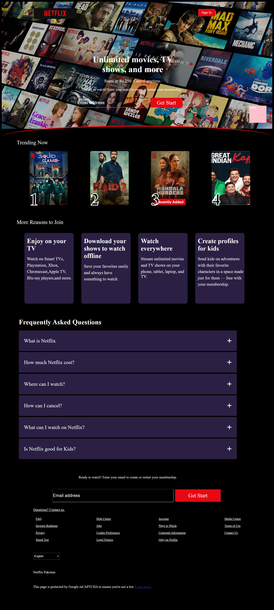

### Netflix Homepage Clone

This is a front-end web development project that aims to replicate the design and layout of the Netflix homepage. The project is built using HTML5 and CSS3, demonstrating skills in modern web design, responsive layouts, and CSS styling techniques.

#### **Features**

* **Responsive Layout:** The design adapts to different screen sizes, providing an optimal viewing experience on both desktop and mobile devices.

  ***Hero Section:** A full-screen background image with a semi-transparent overlay and a centered call-      to-action for user sign-up.
* **Trending Now Section:** A horizontal scrollable section for showcasing popular movies and TV shows with numbered rankings.
* **Reasons to Join Section:** A series of cards highlighting key features of the service, each with a title, description, and an illustrative icon.
* **FAQ Section:** A section for frequently asked questions, with a collapsible design (using an accordion-style component).
* **Footer:** A clean footer with multiple columns for navigation links, a language selector, and copyright information.
* **Custom Styling:** Utilizes custom fonts, shadows, and gradients to closely match the original Netflix branding and aesthetic.
* 2 successful queries

That's a fantastic project! It looks like you've put a lot of work into recreating the Netflix homepage. It's a great exercise in modern web development.

Here is a `README.md` file for your project, formatted to be professional and informative. I've broken it down into sections that are standard for open-source projects, and I've included a "Features" section based on the code and screenshots you've shared.

---

### Netflix Homepage Clone

This is a front-end web development project that aims to replicate the design and layout of the Netflix homepage. The project is built using HTML5 and CSS3, demonstrating skills in modern web design, responsive layouts, and CSS styling techniques.

#### **Table of Contents**

* [Features](https://www.google.com/search?q=%23features)
* [Technologies Used](https://www.google.com/search?q=%23technologies-used)
* [Live Demo](https://www.google.com/search?q=%23live-demo)
* [Getting Started](https://www.google.com/search?q=%23getting-started)
* [Screenshots](https://www.google.com/search?q=%23screenshots)
* [License](https://www.google.com/search?q=%23license)
* [Acknowledgments](https://www.google.com/search?q=%23acknowledgments)

#### **Features**

* **Responsive Layout:** The design adapts to different screen sizes, providing an optimal viewing experience on both desktop and mobile devices.
* **Hero Section:** A full-screen background image with a semi-transparent overlay and a centered call-to-action for user sign-up.
* **Trending Now Section:** A horizontal scrollable section for showcasing popular movies and TV shows with numbered rankings.
* **Reasons to Join Section:** A series of cards highlighting key features of the service, each with a title, description, and an illustrative icon.
* **FAQ Section:** A section for frequently asked questions, with a collapsible design (using an accordion-style component).
* **Footer:** A clean footer with multiple columns for navigation links, a language selector, and copyright information.
* **Custom Styling:** Utilizes custom fonts, shadows, and gradients to closely match the original Netflix branding and aesthetic.

#### **Technologies Used**

* **HTML5:** The core markup language for structuring the webpage content.
* **CSS3:** Used for styling, layout, and visual effects, including Flexbox for alignment, background images, and custom pseudo-elements.
* **Font Awesome:** A popular icon library for scalable vector icons, used for a few of the elements.
* 

#### **Live Demo**

*Note: If you are running this locally, you can view it by opening `index.html` in your web browser.*

#### **Getting Started**

To get a local copy up and running, follow these simple steps.

###### 1. Clone the repository:

https://github.com/MuhammadArshadKhokhar/Amazon-Clone.git

###### 2. Navigate to the project directory:

Amazon-Clone

###### 3. Open the file:

Open the `index.html` file in your favorite web browser to view the project.

#### Screenshots

###### Desktop View:

#### Acknowledgments

* A special thank you to the Netflix design team for the inspiration.
* Mention any other resources, tutorials, or libraries that were particularly helpful.
